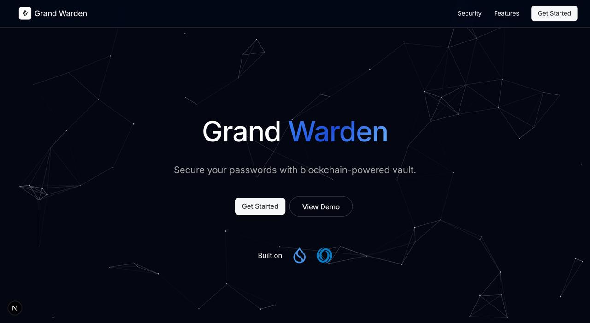
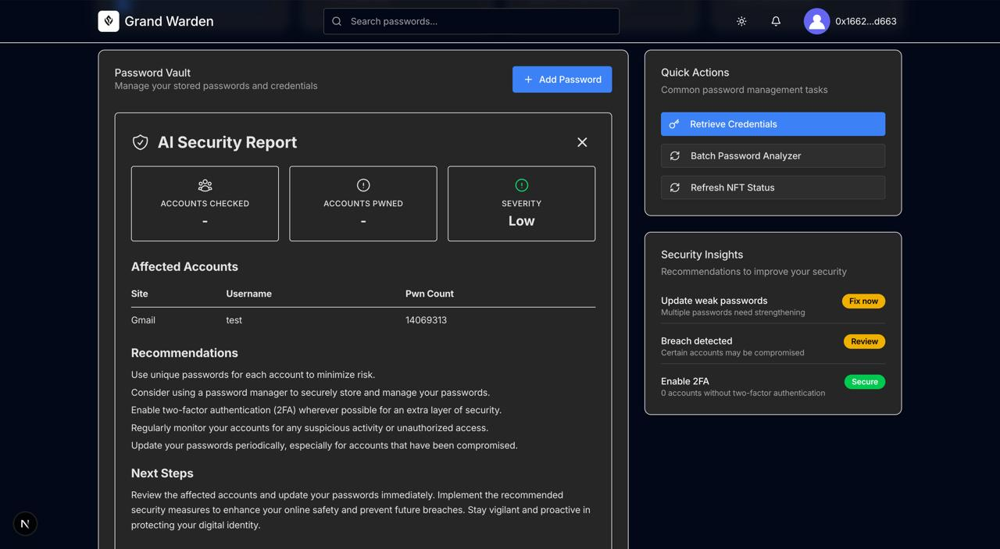
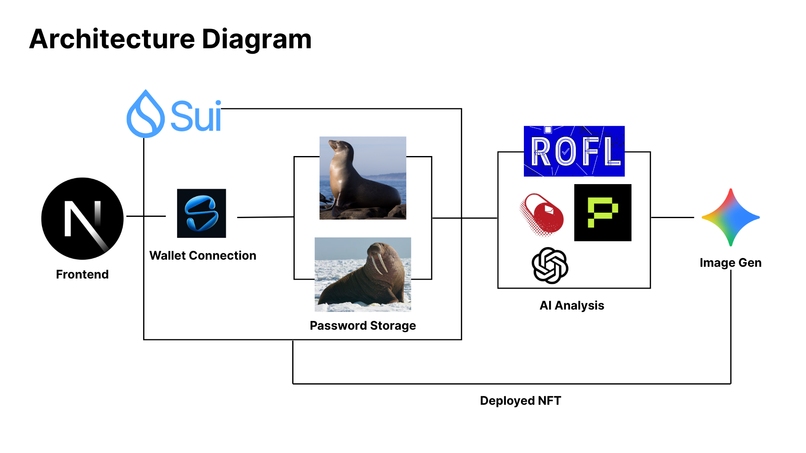

# Grand Warden 🛡️👑

## Tackling Digital Security in the Age of Data Breaches

Empowering proactive password security: AI-powered risk analysis, decentralized storage, and on-chain trust for everyone.

---

## 🖼️ Project Screenshots


*Grand Warden Landing Page*


*Grand Warden AI Analysis Results*

---

## 🚀 Live Demo

- **Live Demo**: [https://b91bb960cdf0.ngrok-free.app](https://b91bb960cdf0.ngrok-free.app)
- **Demo Video**: [https://youtu.be/ir0vNm6ZuCE](https://youtu.be/ir0vNm6ZuCE)

---

## 💡 Inspiration: How We Came Up With This Idea

We realized that even the best password managers today leave users exposed to breaches, phishing, and seed loss—often because secrets are stored in ways that can be compromised, or because users are left to interpret security signals on their own. What if there was a way to make password and wallet security proactive, verifiable, and privacy-preserving—so that every user could see their true risk posture, and no secret ever left a trusted enclave?

That question sparked Grand Warden. By combining decentralized storage (Walrus), strong client-side encryption (Seal), confidential AI analysis (ROFL), and on-chain attestations (SUI NFT), we built a platform that:

- Keeps your credentials private and decentralized
- Analyzes password strength and risk in a secure enclave (never exposing secrets)
- Monitors for breaches and alerts you in real time
- Issues a blockchain-bound NFT badge representing your current risk level
- Provides actionable, human-friendly security reports

---

## 🛡️ What is Grand Warden?

Grand Warden is a security-focused application that safeguards user credentials by combining decentralized storage, strong encryption, confidential AI analysis, and on-chain attestations:

- **Secure, decentralized storage** with Walrus
- **Robust client-side encryption** with Seal
- **Private, in-enclave password analysis** by an LLM running inside a ROFL trusted execution environment
- **Continuous breach monitoring** against global leak databases
- **Actionable, human-friendly security reports**
- **A SUI-bound NFT** that represents your current risk posture (High Risk / Low Risk / Safe) and is shown on your dashboard

This turns a traditional password manager into a proactive cybersecurity tool while keeping plaintext credentials confined to trusted execution and never exposed to the app backend.

---

## ✨ Features

- **🛡️ Zero-Knowledge Security**: Aggregates and encrypts credentials locally—never exposes plaintext to the cloud
- **🧠 Confidential AI Analysis**: Uses AI (in a secure ROFL enclave) to analyze password strength, risky patterns, and hygiene
- **🌐 Breach Monitoring**: Monitors global breach datasets and raises timely alerts if credentials are found
- **🎨 Dynamic NFT Badges**: Issues non-fungible risk badges on SUI, bound to accounts and visible in the UI
- **📊 Actionable Insights**: Provides concise, actionable recommendations to improve security posture
- **🔑 Seedless Onboarding**: Supports zkLogin (Google/Facebook) for frictionless access
- **⚡ Trusted Execution**: All sensitive operations (analysis, signing) happen inside TEE (ROFL/Sapphire)
- **🎭 Interactive UI**: Modern, responsive interface with 3D globe visualization and particle effects
- **📱 Device Registry**: Tracks and manages multiple devices for comprehensive security overview

---

## 🏗️ System Architecture



*Grand Warden System Architecture: Frontend → Wallet Connection & Sui → Password Storage (Walrus/Seal) → AI Analysis (ROFL/OpenAI) → Image Generation → Deployed NFT*

### Core Components

- **Frontend** (`/webapp`): Next.js 15 dashboard with 3D visualizations and AI integration
- **Wallet Connection**: Sui blockchain integration with zkLogin support
- **Password Storage**: Walrus decentralized storage with Seal client-side encryption
- **AI Analysis**: ROFL trusted execution environment for confidential AI processing
- **Image Generation**: AI-powered security artwork creation
- **NFT Deployment**: SUI blockchain NFT minting and management
- **Backend API** (`/webapp_backend`): Express.js server for credential storage and retrieval
- **ROFL Worker** (`/infrastructure/rofl-worker`): Rust-based bridge connecting Sui to Sapphire
- **Smart Contracts** (`/SUI-contracts`): Move contracts for Security NFT and device registry
- **Infrastructure** (`/infrastructure`): Docker containers and deployment configurations

---

## 🛠️ Technology Stack

### Frontend
- **React 19.1.0** with **Next.js 15.4.6** for web dashboard
- **Tailwind CSS 4** for utility-first styling
- **shadcn/ui & tweakcn** components for consistent design system
- **Magic UI** for advanced interactive components and effects
- **Aceternity UI** for cutting-edge UI components and animations
- **Three.js** and **React Three Fiber** for 3D globe visualization
- **Framer Motion** for smooth animations and interactions
- **Lucide React** for modern iconography
- **Particles.js** for interactive background effects

### Backend & Infrastructure
- **Express.js** for API server
- **Node.js** with ES modules
- **Docker** for containerization
- **Rust** for ROFL worker (performance-critical components)

### Blockchain & Security
- **Sui Blockchain**: NFT minting
- **ROFL (Runtime OFfload)**: Official Oasis application for confidential compute
- **Walrus**: Decentralized storage with client-side encryption
- **Seal**: Client-side encryption library for zero-knowledge operations

### AI & Analysis
- **Red Pill(gpt 4o) by Phala Network**: Password strength analysis and security insights
- **ROFL Enclave**: Secure AI processing in trusted execution environment
- **Real-time Monitoring**: Continuous security posture assessment

---

## 🔗 Project Structure

```
apudevmatch2025/
├── webapp/                 # Next.js 15 web dashboard
├── webapp_backend/         # Express.js API server
├── SUI-contracts/          # Move smart contracts
├── infrastructure/         # ROFL worker & deployment
└── appendix/               # Project assets & documentation
```

---

## 🚀 Getting Started

### Prerequisites
- **Node.js 18+** (or 20+)
- **npm** or **pnpm**
- **Docker** (for ROFL worker and local development)
- **Modern browser** with Web3 support
- **Sui testnet wallet** with SUI tokens
- **Sapphire testnet wallet** with ROSE tokens

### 1. Web Dashboard
```bash
cd webapp
npm install
npm run dev
# Access at http://localhost:3000
```

### 2. Backend API Server
```bash
cd webapp_backend
npm install
# Copy .env.example to .env and configure
npm run dev
# Server runs on http://localhost:3001
```

### 3. ROFL Worker (Infrastructure)
```bash
cd infrastructure/rofl-worker
# See detailed setup in infrastructure/rofl-worker/README.md
cargo build --release
docker compose up -d
```

### 4. Smart Contracts
```bash
cd SUI-contracts/security_nft
# Deploy to Sui testnet
# See SUI-contracts/README.md for deployment instructions
```

---

## 🔧 Configuration

### Environment Variables

#### Web App Backend (`.env`)
```bash
WALRUS_PUBLISHER=https://publisher-devnet.walrus.space
WALRUS_AGGREGATOR=https://aggregator-devnet.walrus.space
SUI_RPC_URL=https://fullnode.testnet.sui.io:443
```

#### ROFL Worker (`.env`)
```bash
SAPPHIRE_PRIVATE_KEY=0x...          # Required: Sapphire wallet private key
SAPPHIRE_RPC_URL=https://testnet.sapphire.oasis.dev
SUI_RPC_URL=https://fullnode.testnet.sui.io:443
CONTRACT_ATOMIC_VAULT_MANAGER=0x... # Required: Deployed contract address
```

#### Web App Frontend (`.env.local`)
```bash
NEXT_PUBLIC_SUI_RPC_URL=https://fullnode.testnet.sui.io:443
NEXT_PUBLIC_WALRUS_WASM_URL=https://unpkg.com/@mysten/walrus-wasm@latest/web/walrus_wasm_bg.wasm
```

---

## 📊 Current Implementation Status

### ✅ **Completed & Production Ready**
- **Web Dashboard**: Full-featured Next.js 15 app with 3D visualizations
- **Backend API**: Express server with Walrus integration
- **ROFL Worker**: Official Oasis application, deployed on testnet
- **Smart Contracts**: Security NFT contract deployed and tested
- **UI Components**: Complete shadcn/ui component library
- **Encryption**: Walrus + Seal integration working
- **3D Visualizations**: Interactive globe and particle effects
- **AI Integration**: OpenAI API integration for security analysis

### 🔮 **Planned Features**
- **Chrome Extension**: Browser integration for seamless credential management
- **Mobile App**: React Native companion application
- **Enterprise Features**: Team management and compliance reporting
- **Multi-chain Support**: Ethereum, Polygon, and other networks

---

## 🧪 Testing & Development

### Local Development
```bash
# Start all services
docker compose -f infrastructure/rofl-worker/compose.yaml up -d
cd webapp_backend && npm run dev &
cd webapp && npm run dev &
```

### Testing
```bash
# Frontend tests
cd webapp && npm run test

# Backend tests
cd webapp_backend && npm run test

# Smart contract tests
cd SUI-contracts/security_nft && sui move test

# ROFL worker tests
cd infrastructure/rofl-worker && cargo test
```

---

## 👥 Team Members

- **Marcus Tan Chi Yau** — Project Lead, Frontend Development
- **Gan Wei Lee** — ROFL, Sui NFT Minting
- **Ivy Chung** — Walrus + Seal Development

---


