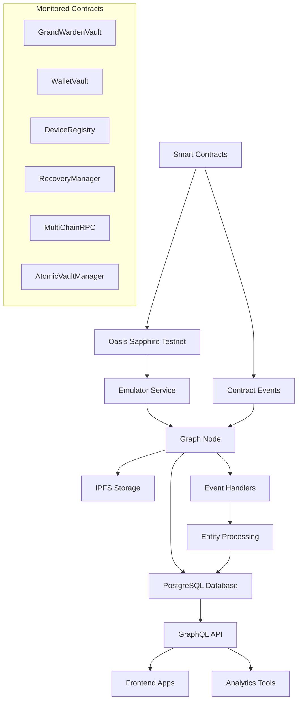
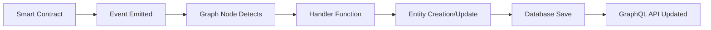

# 🔐 Grand Warden Subgraph

A comprehensive blockchain indexing solution for the Grand Warden password management system on Oasis Sapphire testnet. This subgraph captures and indexes all contract events in real-time, providing a powerful GraphQL API for querying password vault, wallet, and device management data.

## 📋 Table of Contents

- [Overview](#overview)
- [Architecture](#architecture)
- [Quick Setup](#quick-setup)
- [Detailed Setup Guide](#detailed-setup-guide)
- [Contract Integration](#contract-integration)
- [Data Schema](#data-schema)
- [GraphQL API](#graphql-api)
- [Event Handlers](#event-handlers)
- [Testing & Verification](#testing--verification)
- [Troubleshooting](#troubleshooting)
- [Advanced Configuration](#advanced-configuration)

## 🎯 Overview

### What is This Subgraph?

The Grand Warden subgraph is a real-time blockchain indexer that:

- **Monitors 6 Smart Contracts** on Oasis Sapphire testnet
- **Captures Events** from password vaults, wallets, and device registrations
- **Provides GraphQL API** for querying indexed data
- **Enables Real-time Queries** without direct blockchain calls
- **Supports Complex Relationships** between users, vaults, wallets, and devices

### Why Use a Subgraph?

Instead of querying the blockchain directly (slow, expensive), the subgraph:

- ✅ **Instant Queries**: GraphQL responses in milliseconds
- ✅ **Complex Filtering**: Search by user, date ranges, activity patterns
- ✅ **Relationship Queries**: Get user's vaults, devices, and activity in one call
- ✅ **Historical Data**: Complete audit trail of all activities
- ✅ **Real-time Updates**: New events indexed automatically

## 🏗️ Architecture



### Components Explained

1. **Emulator Service**: Bridges Graph Node to Oasis Sapphire (handles unsupported RPC methods)
2. **Graph Node**: Core indexing engine that syncs blocks and processes events
3. **PostgreSQL**: Stores processed entities and relationships
4. **IPFS**: Stores subgraph manifest and metadata
5. **Event Handlers**: TypeScript functions that process blockchain events into entities

## 🚀 Quick Setup

### Prerequisites

- **Docker & Docker Compose**: For running the infrastructure
- **Node.js 18+**: For building and deploying the subgraph
- **Git**: For cloning the repository

### One-Command Start

```bash
# Clone and start everything
git clone <your-repo>
cd infrastructure/subgraph/docker
docker-compose up -d

# Deploy the subgraph
cd ../grandwarden-subgraph
npm install
npm run deploy
```

**Expected Output:**

```
✅ Graph Node: http://localhost:8000
✅ GraphQL Playground: http://localhost:8000/subgraphs/name/grandwarden-vault
✅ Sync Status: Indexing from block 12891651
✅ Real-time indexing: Active
```

## 📖 Detailed Setup Guide

### Step 1: Infrastructure Setup

Navigate to the Docker directory:

```bash
cd infrastructure/subgraph/docker
```

Start all services:

```bash
docker-compose up -d
```

**What's Starting:**

- **Graph Node** (Port 8000): Main indexing engine
- **PostgreSQL** (Port 5432): Database for indexed data
- **IPFS** (Port 5001): Distributed storage for subgraph files
- **Emulator** (Port 8545): Oasis Sapphire bridge service

**Verify Services:**

```bash
docker-compose ps
```

Expected output:

```
NAME                  STATUS              PORTS
docker-graph-node-1   Up 2 minutes        0.0.0.0:8000->8000/tcp
docker-postgres-1     Up 2 minutes        0.0.0.0:5432->5432/tcp
docker-ipfs-1         Up 2 minutes        0.0.0.0:5001->5001/tcp
docker-emulator-1     Up 2 minutes        0.0.0.0:8545->8545/tcp
```

### Step 2: Subgraph Deployment

Navigate to the subgraph directory:

```bash
cd ../grandwarden-subgraph
```

Install dependencies:

```bash
npm install
```

Build the subgraph:

```bash
npm run codegen  # Generate types from ABIs
npm run build    # Compile TypeScript handlers
```

Create the subgraph:

```bash
npx graph create --node http://localhost:8020 grandwarden-vault
```

Deploy the subgraph:

```bash
npx graph deploy --node http://localhost:8020 --ipfs http://localhost:5001 grandwarden-vault
```

**Expected Deployment Output:**

```
✔ Upload subgraph to IPFS

Build completed: QmYourSubgraphHash...

✔ Deploy to Graph node

Deployed to http://localhost:8000/subgraphs/name/grandwarden-vault

Subgraph endpoints:
Queries (HTTP):     http://localhost:8000/subgraphs/name/grandwarden-vault
Subscriptions (WS): ws://localhost:8001/subgraphs/name/grandwarden-vault
```

### Step 3: Verification

Check subgraph status:

```bash
curl -X POST \
  -H "Content-Type: application/json" \
  -d '{"query":"{ _meta { hasIndexingErrors block { number } } }"}' \
  http://localhost:8000/subgraphs/name/grandwarden-vault
```

Expected response:

```json
{
  "data": {
    "_meta": {
      "hasIndexingErrors": false,
      "block": {
        "number": 12891650
      }
    }
  }
}
```

## 📄 Contract Integration

### Monitored Contracts

The subgraph monitors these deployed contracts on Oasis Sapphire testnet:

| Contract               | Address                                      | Purpose                   |
| ---------------------- | -------------------------------------------- | ------------------------- |
| **GrandWardenVault**   | `0xB6B183a041D077d5924b340EBF41EE4546fE0bcE` | Password vault management |
| **WalletVault**        | `0x3B7dd63D236bDB0Fd85d556d2AC70e2746cF5F82` | Web3 wallet storage       |
| **DeviceRegistry**     | `0x9ec3B09A3cDc7Dd2ba8fB8F6e9Bd6C04DDfBCd2d` | Device authorization      |
| **RecoveryManager**    | `0x58fF6e3d3D76053F2B13327A6399ECD25E363818` | Account recovery          |
| **MultiChainRPC**      | `0x2bcaA2dDbAE6609Cbd63D3a4B3dd0af881759472` | Cross-chain operations    |
| **AtomicVaultManager** | `0x811182419a4e4F419ec100ac0Cd63fc1Fef2810C` | Atomic transactions       |

### Sync Configuration

```yaml
# subgraph.yaml
dataSources:
  - kind: ethereum/contract
    name: GrandWardenVault
    network: oasis # Matches docker-compose.yml ethereum config
    source:
      address: "0xB6B183a041D077d5924b340EBF41EE4546fE0bcE"
      abi: GrandWardenVault
      startBlock: 12891651 # Contract deployment block
```

**Important Notes:**

- **Network Name**: Must be `oasis` to match emulator configuration
- **Start Block**: Indexing begins from contract deployment block
- **Contract Filtering**: Only monitors specified addresses (ignores all other blockchain activity)

## 🗃️ Data Schema

### Core Entities

#### User

Represents a unique address that interacts with the system.

```graphql
type User @entity {
  id: Bytes! # User's wallet address
  totalVaults: BigInt! # Number of password vaults created
  totalWallets: BigInt! # Number of wallets imported
  totalDevices: BigInt! # Number of devices registered
  createdAt: BigInt! # First interaction timestamp
  lastActivity: BigInt! # Most recent activity timestamp
  # Relationships
  vaults: [Vault!]! @derivedFrom(field: "owner")
  wallets: [Wallet!]! @derivedFrom(field: "owner")
  devices: [Device!]! @derivedFrom(field: "user")
}
```

#### Vault

Password vault created by a user.

```graphql
type Vault @entity {
  id: Bytes! # Unique vault identifier
  owner: User! # Vault owner
  isActive: Boolean! # Whether vault is active
  createdAt: BigInt! # Creation timestamp
  lastUpdated: BigInt! # Last modification timestamp
  lastAccessed: BigInt! # Last access timestamp
  accessCount: BigInt! # Number of times accessed
  # Relationships
  credentials: [Credential!]! @derivedFrom(field: "vault")
}
```

#### Device

Authorized device for a user.

```graphql
type Device @entity {
  id: Bytes! # Unique device identifier
  user: User! # Device owner
  deviceName: String! # Human-readable device name
  publicKeyHash: Bytes! # Device's public key hash
  deviceType: BigInt! # Device type (0=Desktop, 1=Mobile, 2=Hardware)
  isActive: Boolean! # Whether device is authorized
  createdAt: BigInt! # Registration timestamp
  lastUsed: BigInt! # Last activity timestamp
}
```

#### Wallet

Imported Web3 wallet.

```graphql
type Wallet @entity {
  id: Bytes! # Unique wallet identifier
  owner: User! # Wallet owner
  chainIds: [BigInt!]! # Supported blockchain networks
  isActive: Boolean! # Whether wallet is active
  createdAt: BigInt! # Import timestamp
  lastUsed: BigInt! # Last activity timestamp
}
```

### Relationship Queries

Query a user with all their data:

```graphql
{
  user(id: "0x742d35Cc6434C0532925a3b2BA371C4DEfD3f99b") {
    id
    totalVaults
    totalDevices

    vaults {
      id
      isActive
      createdAt
      credentials {
        service
        createdAt
      }
    }

    devices {
      id
      deviceName
      isActive
    }
  }
}
```

## 🔍 GraphQL API

### Endpoint Information

- **HTTP Queries**: `http://localhost:8000/subgraphs/name/grandwarden-vault`
- **WebSocket Subscriptions**: `ws://localhost:8001/subgraphs/name/grandwarden-vault`
- **GraphQL Playground**: Open HTTP URL in browser for interactive queries

### Common Queries

#### 1. Get All Users with Activity

```graphql
{
  users(first: 10, orderBy: lastActivity, orderDirection: desc) {
    id
    totalVaults
    totalDevices
    lastActivity
    createdAt
  }
}
```

#### 2. Search Vaults by Owner

```graphql
{
  vaults(where: { owner: "0x742d35Cc6434C0532925a3b2BA371C4DEfD3f99b" }) {
    id
    isActive
    createdAt
    lastAccessed
    accessCount
    credentials {
      service
      createdAt
    }
  }
}
```

#### 3. Find Recent Device Registrations

```graphql
{
  devices(
    first: 5
    orderBy: createdAt
    orderDirection: desc
    where: { isActive: true }
  ) {
    id
    deviceName
    user {
      id
    }
    createdAt
  }
}
```

#### 4. Get Subgraph Sync Status

```graphql
{
  _meta {
    hasIndexingErrors
    block {
      number
      hash
    }
  }
}
```

#### 5. Filter by Date Range

```graphql
{
  vaults(
    where: {
      createdAt_gte: "1640995200" # Jan 1, 2022
      createdAt_lte: "1672531200" # Jan 1, 2023
    }
  ) {
    id
    owner {
      id
    }
    createdAt
  }
}
```

### Advanced Filtering

The Graph Protocol supports powerful filtering options:

- **Exact Match**: `{ id: "0x123..." }`
- **Greater Than**: `{ createdAt_gte: "1640995200" }`
- **Less Than**: `{ createdAt_lte: "1672531200" }`
- **In Array**: `{ chainIds_contains: [1, 137] }`
- **Text Search**: `{ deviceName_contains: "iPhone" }`
- **Boolean**: `{ isActive: true }`

## ⚙️ Event Handlers

### How Events Become Data

When a smart contract emits an event, the subgraph processes it through handler functions:

```typescript
// src/mappings/grandWardenVault.ts
export function handleVaultCreated(event: VaultCreatedEvent): void {
  // 1. Create or load User entity
  let user = createOrLoadUser(event.params.user);

  // 2. Create new Vault entity
  let vault = new Vault(event.params.vaultId);
  vault.owner = user.id;
  vault.isActive = true;
  vault.createdAt = event.block.timestamp;
  vault.lastUpdated = event.block.timestamp;
  vault.lastAccessed = event.block.timestamp;
  vault.accessCount = BigInt.fromI32(0);

  // 3. Update User statistics
  user.totalVaults = user.totalVaults.plus(BigInt.fromI32(1));
  user.lastActivity = event.block.timestamp;

  // 4. Save entities to database
  vault.save();
  user.save();

  // 5. Update daily statistics
  updateDailyStats(event.block.timestamp);
}
```

### Event Processing Flow



### Handler Functions by Contract

#### GrandWardenVault Events

- **VaultCreated**: Creates new vault and updates user statistics
- **VaultUpdated**: Updates vault metadata and timestamps
- **VaultAccessed**: Increments access count and updates last accessed time
- **CredentialAdded**: Creates credential entry linked to vault
- **BreachAlert**: Creates security alert entity

#### DeviceRegistry Events

- **DeviceRegistered**: Creates new device entity and updates user
- **DeviceAuthorized**: Updates device authorization status
- **DeviceRevoked**: Deactivates device
- **AccessGranted**: Logs successful device access
- **SecurityAlert**: Creates security event record

#### WalletVault Events

- **WalletImported**: Creates wallet entity with chain support
- **BalancesFetched**: Updates wallet balance information
- **TransactionSigned**: Records transaction signing activity

### Error Handling

Handlers include comprehensive error handling:

```typescript
export function handleVaultCreated(event: VaultCreatedEvent): void {
  try {
    // Entity processing logic
  } catch (error) {
    log.error("Error processing VaultCreated event: {}", [error.toString()]);
    // Continue processing (don't fail the entire sync)
  }
}
```

## 🧪 Testing & Verification

### Manual Testing Script

Run the test script to verify everything is working:

```bash
cd infrastructure/oasis
npx hardhat run scripts/simple-subgraph-test.ts --network sapphire-testnet
```

**Expected Output:**

```
🚀 GRAND WARDEN SUBGRAPH SIMPLE TEST
====================================
🔍 Checking subgraph status...
   📦 Current Block: 12891813
   ❌ Has Errors: false

📊 QUERYING ALL INDEXED DATA
=============================
📈 Found 1 users
📈 Found 7 vaults
📈 Found 5 devices

📱 TESTING DEVICE REGISTRY
==========================
📝 Registering test device...
   📋 Transaction Hash: 0xfee117a89fe56416f8114fcb849e82ef2171b57e5c260c4604978855e796c337
   🧱 Block Number: 12900675
   ✅ DEVICE REGISTERED EVENT EMITTED!
```

### Monitoring Script

Monitor real-time sync progress:

```bash
# PowerShell
.\scripts\monitor-subgraph.ps1

# Or simple status check
$body = '{"query":"{_meta{hasIndexingErrors block{number}}}"}';
Invoke-RestMethod -Uri "http://localhost:8000/subgraphs/name/grandwarden-vault" -Method Post -ContentType "application/json" -Body $body
```

### Verification Checklist

- [ ] **Docker Services Running**: All 4 containers healthy
- [ ] **Graph Node Responding**: HTTP 200 on port 8000
- [ ] **No Indexing Errors**: `hasIndexingErrors: false`
- [ ] **Block Progression**: Block number increasing over time
- [ ] **Data Being Indexed**: Users/vaults/devices count > 0
- [ ] **GraphQL Queries Working**: Successful query responses

## 🔧 Troubleshooting

### Common Issues

#### 1. Subgraph Not Syncing

**Symptoms**: Block number not increasing

```bash
# Check Graph Node logs
docker-compose logs graph-node
```

**Solutions**:

- Restart emulator: `docker-compose restart emulator`
- Check network connectivity to Oasis Sapphire
- Verify emulator configuration in `docker-compose.yml`

#### 2. GraphQL Errors

**Symptoms**: Query returns errors or empty data

```bash
# Test basic connectivity
curl http://localhost:8000/subgraphs/name/grandwarden-vault
```

**Solutions**:

- Verify subgraph deployment: `npx graph info grandwarden-vault`
- Check entity relationships in schema
- Validate query syntax in GraphQL Playground

#### 3. Contract Events Not Captured

**Symptoms**: Expected events missing from subgraph

```bash
# Check if contract addresses match
grep -r "0xB6B183a041D077d5924b340EBF41EE4546fE0bcE" subgraph.yaml
```

**Solutions**:

- Verify contract addresses in `subgraph.yaml`
- Check start block number
- Ensure event signatures match contract ABI

#### 4. Docker Service Issues

**Symptoms**: Services not starting or crashing

```bash
# Check service status
docker-compose ps
docker-compose logs <service-name>
```

**Solutions**:

- Free up ports (8000, 8001, 5001, 5432, 8545)
- Increase Docker memory allocation
- Clean up old containers: `docker system prune`

### Debug Commands

```bash
# Check subgraph deployment status
npx graph info grandwarden-vault --node http://localhost:8020

# View recent logs
docker-compose logs --tail=50 graph-node

# Test IPFS connectivity
curl http://localhost:5001/api/v0/version

# Test PostgreSQL connection
docker exec -it docker-postgres-1 psql -U graph-node -d graph-node

# Check emulator status
curl http://localhost:8545 -X POST -H "Content-Type: application/json" -d '{"jsonrpc":"2.0","method":"eth_blockNumber","params":[],"id":1}'
```

## ⚙️ Advanced Configuration

### Custom Network Configuration

To connect to a different network, update `docker-compose.yml`:

```yaml
environment:
  ethereum: "your-network:http://emulator:8545"
```

And update `subgraph.yaml`:

```yaml
dataSources:
  - network: your-network # Must match docker-compose
```

### Performance Tuning

#### Database Optimization

```yaml
# docker-compose.yml - PostgreSQL settings
command:
  [
    "postgres",
    "-cshared_preload_libraries=pg_stat_statements",
    "-cmax_connections=200",
    "-cwork_mem=256MB",
    "-ceffective_cache_size=2GB",
  ]
```

#### Graph Node Optimization

```yaml
environment:
  GRAPH_LOG: info
  ETHEREUM_POLLING_INTERVAL: 1000 # 1 second polling
  ETHEREUM_BLOCK_CHUNK_SIZE: 10 # Process 10 blocks at once
```

### Subgraph Versioning

Deploy new versions with labels:

```bash
# Deploy version 1.0.0
npx graph deploy grandwarden-vault --version-label v1.0.0

# List deployed versions
npx graph info grandwarden-vault
```

### Data Retention

Configure data retention in PostgreSQL:

```sql
-- Keep only last 30 days of detailed events
DELETE FROM sgd1.event_data
WHERE block_timestamp < extract(epoch from now() - interval '30 days');
```

## 📊 Expected Performance

### Sync Performance

- **Initial Sync**: ~100-500 blocks/minute (depends on network activity)
- **Real-time Sync**: <5 second delay from block production
- **Query Response**: <100ms for typical queries
- **Database Size**: ~1-10MB per 10,000 blocks (depends on event density)

### Resource Usage

- **Graph Node**: 1-2 CPU cores, 2-4GB RAM
- **PostgreSQL**: 1 CPU core, 1-2GB RAM
- **IPFS**: 0.5 CPU core, 512MB RAM
- **Emulator**: 0.5 CPU core, 256MB RAM

### Scalability Limits

- **Query Rate**: 1000+ queries/second
- **Concurrent Users**: 100+ simultaneous GraphQL connections
- **Data Volume**: Millions of entities (with proper indexing)
- **Historical Range**: No theoretical limit (constrained by storage)

## 🎯 Production Deployment

### Security Considerations

1. **Network Isolation**: Use private networks for production
2. **Access Control**: Implement authentication for GraphQL endpoint
3. **Rate Limiting**: Prevent query abuse
4. **Monitoring**: Set up alerts for sync failures
5. **Backup Strategy**: Regular PostgreSQL backups

### Monitoring Setup

```bash
# Health check endpoint
curl http://localhost:8030/  # Indexing status

# Prometheus metrics
curl http://localhost:8040/metrics

# Custom monitoring query
{
  _meta {
    hasIndexingErrors
    block {
      number
    }
  }
}
```

## 📚 Additional Resources

- **The Graph Documentation**: https://thegraph.com/docs/
- **GraphQL Query Guide**: https://graphql.org/learn/queries/
- **Oasis Sapphire Docs**: https://docs.oasis.io/dapp/sapphire/
- **Docker Compose Reference**: https://docs.docker.com/compose/

## 🤝 Contributing

To modify the subgraph:

1. **Update Schema**: Edit `schema.graphql`
2. **Regenerate Types**: Run `npm run codegen`
3. **Update Handlers**: Modify files in `src/mappings/`
4. **Test Locally**: Deploy to local Graph Node
5. **Deploy**: Update production deployment

---

**🎉 Your Grand Warden subgraph is now ready for production use!**

This setup provides real-time blockchain indexing with powerful GraphQL queries, enabling your frontend applications to deliver fast, responsive user experiences while maintaining complete auditability of all password management activities.
