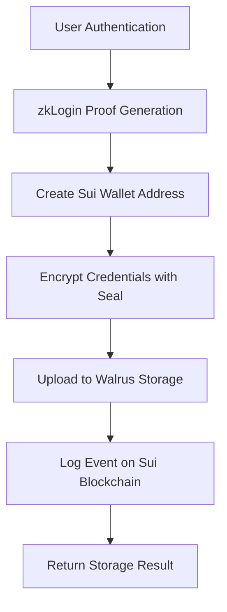

# Grand Warden Backend Implementation Documentation

This document provides a complete breakdown of the backend implementation for Grand Warden, a secure password manager that integrates zkLogin, Walrus storage, Seal encryption, and Sui blockchain logging.

## Table of Contents

1. [Architecture Overview](#architecture-overview)
2. [Move Smart Contract](#move-smart-contract)
3. [TypeScript Service Layer](#typescript-service-layer)
4. [Development Environment](#development-environment)
5. [Testing & Deployment](#testing--deployment)
6. [API Reference](#api-reference)
7. [Security Considerations](#security-considerations)
8. [Future Enhancements](#future-enhancements)

---

## Architecture Overview

### High-Level Flow



### Technology Stack

| Component           | Technology         | Purpose                                      |
| ------------------- | ------------------ | -------------------------------------------- |
| **Blockchain**      | Sui Devnet         | On-chain event logging and wallet management |
| **Storage**         | Walrus Testnet v2  | Encrypted credential storage                 |
| **Encryption**      | Seal SDK           | Threshold encryption of sensitive data       |
| **Backend**         | TypeScript/Node.js | Service orchestration and API                |
| **Smart Contracts** | Move               | On-chain event logging                       |

---

## Move Smart Contract

### Package Details

- **Package ID**: `0xe81807dee07154d47c71a01274191b9fea8dcdb8d85ad25033263c94a7002d3f`
- **Network**: Sui Devnet
- **Module**: `store_logger`
- **Function**: `log_credential_store`

### Contract Structure

```move
module store_logger::store_logger {
    use sui::object::{Self, UID};
    use sui::transfer;
    use sui::tx_context::TxContext;
    use std::string::{Self, String};
    use sui::event;

    /// Event emitted when credentials are stored
    public struct CredentialStoreEvent has copy, drop {
        user_address: address,
        walrus_blob_id: String,
        walrus_cid: String,
        timestamp: u64,
    }

    /// Capability for logging events
    public struct LogCap has key {
        id: UID,
    }

    /// Initialize the module by creating and transferring the LogCap
    fun init(ctx: &mut TxContext) {
        let log_cap = LogCap {
            id: object::new(ctx),
        };
        transfer::transfer(log_cap, tx_context::sender(ctx));
    }

    /// Log a credential storage event
    public entry fun log_credential_store(
        _log_cap: &LogCap,
        user_address: address,
        walrus_blob_id: vector<u8>,
        walrus_cid: vector<u8>,
        ctx: &mut TxContext
    ) {
        let event = CredentialStoreEvent {
            user_address,
            walrus_blob_id: string::utf8(walrus_blob_id),
            walrus_cid: string::utf8(walrus_cid),
            timestamp: tx_context::epoch(ctx),
        };

        // Emit the event
        event::emit(event);
    }
}
```

### Key Features

1. **Event Emission**: Logs credential storage events on-chain
2. **Capability Pattern**: Uses `LogCap` for access control
3. **String Handling**: Converts byte arrays to Move strings
4. **Timestamp**: Records epoch timestamp for audit trails

### Deployment Commands

```bash
# Compile and test
cd webapp_backend/store_logger
sui move test

# Publish to devnet
sui client publish --gas-budget 100000000
```

---

## TypeScript Service Layer

### Service Architecture

The `CredentialService` class orchestrates the entire credential storage flow:

```typescript
export class CredentialService {
  private suiClient: SuiClient;
  private keypair: Ed25519Keypair;
  private packageId: string;
  private logCapId: string;
}
```

### Core Methods

#### 1. `storeCredentials(credentials: CredentialData)`

Main orchestration method that:

- Encrypts credentials (placeholder for Seal)
- Uploads to Walrus (simulated)
- Logs event on Sui blockchain
- Returns storage result

#### 2. `encryptCredentials(credentials: CredentialData)`

**Current Implementation**: Simple JSON encoding
**Future Implementation**: Seal SDK integration

```typescript
private async encryptCredentials(credentials: CredentialData): Promise<Uint8Array> {
  const jsonString = JSON.stringify(credentials);
  const encoder = new TextEncoder();
  return encoder.encode(jsonString);
}
```

#### 3. `uploadToWalrus(encryptedData: Uint8Array)`

**Current Implementation**: Mock upload with simulated IDs
**Future Implementation**: Real Walrus HTTP API

```typescript
private async uploadToWalrus(encryptedData: Uint8Array): Promise<{ blobId: string; cid: string }> {
  const mockBlobId = `blob_${Date.now()}_${Math.random().toString(36).substr(2, 9)}`;
  const mockCid = `bafybeih${Math.random().toString(36).substr(2, 32)}`;

  return { blobId: mockBlobId, cid: mockCid };
}
```

#### 4. `logOnChain(blobId: string, cid: string)`

Executes Move transaction to log storage event:

```typescript
private async logOnChain(blobId: string, cid: string): Promise<string> {
  const tx = new Transaction();

  const blobIdBytes = new TextEncoder().encode(blobId);
  const cidBytes = new TextEncoder().encode(cid);

  tx.moveCall({
    target: `${this.packageId}::store_logger::log_credential_store`,
    arguments: [
      tx.object(this.logCapId),
      tx.pure(this.keypair.getPublicKey().toSuiAddress() as any),
      tx.pure(blobIdBytes),
      tx.pure(cidBytes),
    ],
  });

  const result = await this.suiClient.signAndExecuteTransaction({
    signer: this.keypair,
    transaction: tx,
    options: { showEffects: true, showEvents: true },
  });

  return result.digest;
}
```

### Data Types

```typescript
interface CredentialData {
  site: string;
  username: string;
  password: string;
  notes?: string;
}

interface StorageResult {
  blobId: string;
  cid: string;
  transactionDigest: string;
}
```

---

## Development Environment

### Project Structure

```
webapp_backend/
├── store_logger/                 # Move smart contract
│   ├── Move.toml
│   ├── sources/
│   │   └── store_logger.move
│   └── tests/
└── services/                     # TypeScript service layer
    ├── package.json
    ├── tsconfig.json
    ├── .env
    └── src/
        ├── credential-service.ts
        └── test.ts
```

### Dependencies

#### Package.json

```json
{
  "dependencies": {
    "@mysten/sui": "^1.37.1",
    "@mysten/walrus": "^0.6.0",
    "dotenv": "^17.2.1",
    "ts-node": "^10.9.2",
    "typescript": "^5.9.2"
  }
}
```

#### Environment Variables (.env)

```bash
# Sui Configuration
SUI_NETWORK=devnet
SUI_RPC_URL=https://fullnode.devnet.sui.io:443

# Walrus Configuration
WALRUS_URL=https://testnet-v2.wal.app

# Move Package Configuration
PACKAGE_ID=0xe81807dee07154d47c71a01274191b9fea8dcdb8d85ad25033263c94a7002d3f
LOG_CAP_ID=0x2529415c46305cdfbfbf6ac5b4c4dcdc25a904b542c84e1e78351b1f69b0c4da

# Development Settings
NODE_ENV=development
```

### TypeScript Configuration

```json
{
  "compilerOptions": {
    "target": "ES2020",
    "module": "CommonJS",
    "moduleResolution": "node",
    "esModuleInterop": true,
    "allowSyntheticDefaultImports": true,
    "strict": true,
    "skipLibCheck": true,
    "forceConsistentCasingInFileNames": true,
    "outDir": "./dist",
    "rootDir": "./src",
    "sourceMap": true,
    "declaration": true,
    "resolveJsonModule": true
  },
  "include": ["src/**/*"],
  "exclude": ["node_modules", "dist"]
}
```

---

## Testing & Deployment

### Test Script

```typescript
// src/test.ts
import { CredentialService } from "./credential-service";

async function main() {
  console.log("🚀 Starting Grand Warden Backend Test");

  const service = new CredentialService();
  console.log("💰 Wallet Address:", service.getWalletAddress());

  await service.testStorage();
  console.log("🏁 Test completed!");
}

main().catch(console.error);
```

### Running Tests

```bash
# Navigate to services directory
cd webapp_backend/services

# Install dependencies
npm install

# Run test
npm run test
```

### Expected Output

```
🚀 Starting Grand Warden Backend Test
=====================================
💰 Wallet Address: 0x...

🔐 Starting credential storage process...
🔒 Encrypting credentials...
🔒 Credentials encrypted (placeholder)
📤 Uploading to Walrus...
📤 Upload successful (simulated): { blobId: 'blob_...', cid: 'bafybeih...' }
⛓️ Logging event on Sui...
⛓️ Transaction successful: 0x...
✅ Credentials stored successfully!
🧪 Test completed successfully!
Results: { blobId: '...', cid: '...', transactionDigest: '...' }
🏁 Test completed!
```

---

## API Reference

### CredentialService Class

#### Constructor

```typescript
constructor();
```

Initializes the service with:

- Sui client (devnet)
- Ed25519 keypair for testing
- Published package and LogCap IDs

#### Methods

##### `storeCredentials(credentials: CredentialData): Promise<StorageResult>`

Main method for storing encrypted credentials.

**Parameters:**

- `credentials`: Object containing site, username, password, and optional notes

**Returns:**

- `StorageResult`: Object with blobId, cid, and transactionDigest

##### `getWalletAddress(): string`

Returns the Sui wallet address for the service.

##### `testStorage(): Promise<void>`

Runs a complete test of the credential storage flow.

### Move Contract Functions

#### `log_credential_store`

```move
public entry fun log_credential_store(
    _log_cap: &LogCap,
    user_address: address,
    walrus_blob_id: vector<u8>,
    walrus_cid: vector<u8>,
    ctx: &mut TxContext
)
```

**Parameters:**

- `_log_cap`: LogCap capability for access control
- `user_address`: Sui wallet address of the user
- `walrus_blob_id`: Walrus blob identifier
- `walrus_cid`: Content identifier for the stored data
- `ctx`: Transaction context

**Events Emitted:**

- `CredentialStoreEvent`: Contains user address, blob ID, CID, and timestamp

---

## Security Considerations

### Current Implementation

1. **Test Keypair**: Uses generated Ed25519 keypair for development
2. **Mock Encryption**: Placeholder encryption (not production-ready)
3. **Simulated Storage**: Mock Walrus upload (not production-ready)

### Production Requirements

1. **zkLogin Integration**: Replace test keypair with zkLogin-generated addresses
2. **Seal Encryption**: Implement real threshold encryption
3. **Walrus Integration**: Use actual Walrus HTTP API
4. **Key Management**: Secure key storage and rotation
5. **Access Control**: Implement proper capability-based access control

### Security Best Practices

1. **Environment Variables**: Never commit secrets to source control
2. **Input Validation**: Validate all user inputs
3. **Error Handling**: Don't expose sensitive information in errors
4. **Audit Logging**: Maintain comprehensive audit trails
5. **Rate Limiting**: Implement rate limiting for API endpoints

---

## Future Enhancements

### Phase 1: Real Integrations

1. **Seal SDK Integration**

   ```typescript
   // Replace placeholder encryption
   const encrypted = await seal.encrypt(data, masterKeyId);
   ```

2. **Walrus HTTP API**

   ```typescript
   // Replace mock upload
   const result = await walrusClient.upload(encryptedData);
   ```

3. **zkLogin Integration**
   ```typescript
   // Replace test keypair
   const walletAddress = await zkLogin.generateAddress(oauthToken);
   ```

### Phase 2: Advanced Features

1. **Credential Retrieval**: Implement secure credential decryption and retrieval
2. **Access Control**: Add user-specific access controls
3. **Audit Trail**: Enhanced on-chain audit logging
4. **Multi-Device Sync**: Synchronize credentials across devices
5. **Backup & Recovery**: Implement secure backup mechanisms

### Phase 3: Production Features

1. **Rate Limiting**: API rate limiting and abuse prevention
2. **Monitoring**: Comprehensive logging and monitoring
3. **Scaling**: Horizontal scaling and load balancing
4. **Compliance**: GDPR, SOC2, and other compliance frameworks
5. **Disaster Recovery**: Backup and recovery procedures

---

## Troubleshooting

### Common Issues

1. **Sui CLI Version Mismatch**

   - Ensure Sui CLI version ≥ 1.53
   - Update with `cargo install --locked --force sui`

2. **TypeScript Import Errors**

   - Use correct import paths: `@mysten/sui/client`
   - Use `Transaction` instead of `TransactionBlock`

3. **Move Compilation Errors**

   - Ensure Git version ≥ 2.41 for dependency resolution
   - Update with `brew install git`

4. **Network Connection Issues**
   - Verify devnet connectivity
   - Check firewall settings

### Debug Commands

```bash
# Check Sui client status
sui client gas

# Verify Move package
sui move test

# Check TypeScript compilation
npx tsc --noEmit

# Run with debug logging
DEBUG=* npm run test
```

---

## Conclusion

This backend implementation provides a solid foundation for Grand Warden's secure credential management system. The current implementation includes:

✅ **Working Move smart contract** for on-chain event logging  
✅ **TypeScript service layer** for orchestration  
✅ **Test environment** with working mock integrations  
✅ **Development tooling** and configuration  
✅ **End-to-end test flow** working successfully

The next steps involve replacing the placeholder implementations with real integrations for Seal encryption, Walrus storage, and zkLogin authentication to create a production-ready system.
